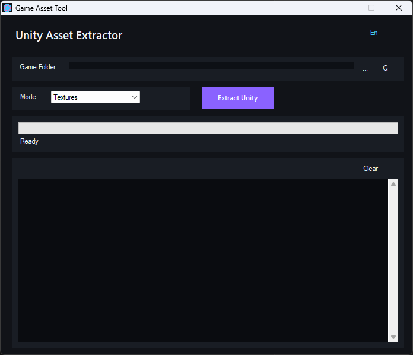

# Game Asset Tool - Unity Edition



Lightweight standalone tool for extracting textures from **Unity games** (.assets, .bundle files).


## Features

- Extract textures (PNG) from Unity .assets files
- Extract textures from .bundle files
- Automatic skipping of localization bundles
- Real-time progress with ETA

## Requirements

- Windows 7/8/10/11
- Python 3.x with UnityPy

```bash
pip install UnityPy
```

## Download

**Latest Release:** [GameAssetTool.exe](https://github.com/SANCHEI/Rpgm-NWJS-Renpy-Converter-tool/releases/tag/v1.2.0-unity)

## Supported Games

Works with any Unity game that has `*_Data` folder.

## Usage

1. Select Unity game folder (auto-detected)
2. Choose extraction mode: Textures / Videos / All
3. Click "Extract"
4. Find extracted files in `game_folder/extracted/`

## Output Structure

```
Game/
├── *_Data/
│   ├── globalgamemanagers.assets
│   ├── sharedassets0.assets
│   └── ...
└── extracted/
    ├── globalgamemanagers/
    │   └── texture.png
    └── sharedassets0/
        └── UI_texture.png
```

## Building from Source

```batch
build.bat
```

Requires:
- .NET Framework 4.0 SDK
- CSC compiler

## License

MIT License

## Author

SANCHEI
