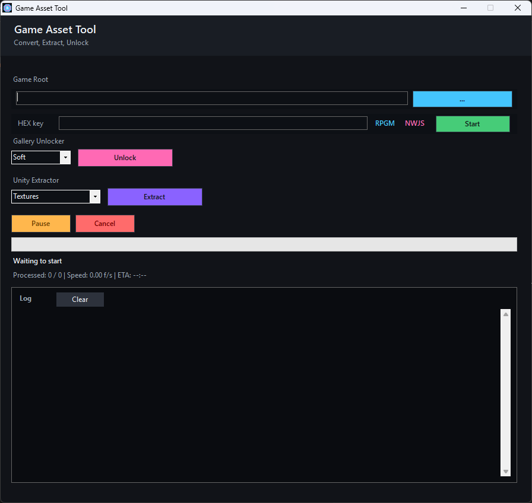

# Game Asset Tool
[](https://youtu.be/y7z-_byQjXo)


Fast converter for **RPGMVP**, **Unity** and **Gallery Unlocker** for **NWJS/Renpy** games.


## Features

- **RPGMVP to PNG Conversion** - Fast conversion with live progress, ETA and task control (pause/cancel)
- **Unity Asset Extractor** - Extract textures from Unity games (.assets, .bundle files)
- **Gallery Unlocker** - Unlock galleries in Renpy/NWJS games
- **Auto-detection** - Automatically detects game type and root folder

## Requirements

- Windows 7/8/10/11
- [.NET Framework 4.0](https://www.microsoft.com/en-us/download/details.aspx?id=17718) or higher
- Python 3.x with UnityPy (for Unity extraction)

### Unity Extraction

```bash
pip install UnityPy
```

## Download

**Full Version:** [GameAssetTool.exe](https://github.com/SANCHEI/Rpgm-NWJS-Renpy-Converter-tool/releases)

For **Unity games only**, use the lighter version: [UnityAssetExtractor.exe](https://github.com/SANCHEI/Rpgm-NWJS-Renpy-Converter-tool/releases/tag/v1.1.0-unity)

## Supported Games

### RPG Maker MV/MZ
- RPGMVP encryption
- Custom HEX key support
- Auto key detection

### Unity Games
- Textures from .assets files
- Textures from .bundle files
- Automatic skipping of localization bundles
- Real-time progress with ETA

### Renpy/NWJS Games
- Gallery unlocker
- NWJS process detection

## Supported Engines

- **RPGM** - RPG Maker MV/MZ
- **NWJS** - Node WebKit Software (Renpy games)
- **Unity** - Unity games

## Usage

### RPGMVP Conversion
1. Select game folder (auto-detected)
2. Enter HEX key (auto-detected for known games)
3. Click Start

### Unity Extraction
1. Select Unity game folder (auto-detected)
2. Choose extraction mode: Textures / Videos / All
3. Click "Extract"
4. Find extracted files in `game_folder/extracted/`

### Gallery Unlocker
1. Select game folder
2. Choose game type: Soft / Hard
3. Click "Unlock"

## Keyboard Shortcuts

- **Ctrl+A** in logs - Select all
- **Ctrl+C** in logs - Copy selected

## Building from Source

```batch
build_winforms.bat
```

Requires:
- .NET Framework 4.0 SDK
- CSC compiler

## License

MIT License

## Author

SANCHEI
